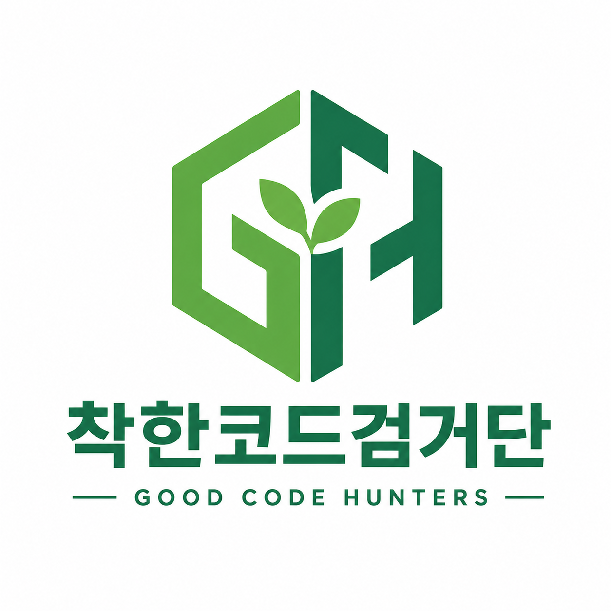

# 착한코드검거단 (Good Code Hunter)

<p align="center">
  
</p>

Python `.py` 파일 하나를 **실행하지 않고** AST 기반으로 정적 분석하여, 코드 안에서 확인 가능한 시큐어 코딩 패턴을 찾아 근거와 함께 보여주는 Windows 데스크톱 프로그램입니다.

기획 참고: [악성코드검거단](https://akdan.co.kr/)의 반대 발상과 OpenAI의 [Harness engineering](https://openai.com/ko-KR/index/harness-engineering/)

> 이 도구는 악성코드 탐지기나 취약점 스캐너가 아닙니다. 파일 전체의 안전성을 판정하거나 보안 점수를 매기지 않으며, 현재 규칙으로 확인된 긍정적인 보안 패턴만 설명합니다.

## 프로젝트 범위

- 입력: 사용자가 GUI에서 선택한 Python `.py` 파일 1개
- 분석: Python 표준 `ast`를 이용한 정적 분석
- 출력: 규칙 ID, 줄 번호, 근거 코드, 설명을 포함한 Finding 목록
- 저장: 결정적인 구조의 UTF-8 JSON 결과
- 실행 환경: Python 3.11+, `tkinter`/`ttk`, Windows
- 배포 목표: PyInstaller `onedir` 빌드
- 금지 사항: 대상 파일 실행·import, LLM 보안 판정, 전체 보안 점수, 폴더/프로젝트 분석

상세 제품 범위는 [PRD.md](PRD.md), 에이전트 작업 규칙은 [AGENTS.md](AGENTS.md), 역할·순서·완료 조건은 [plan.md](plan.md)를 따릅니다. 문서 간 우선순위는 `PRD.md → AGENTS.md → plan.md`입니다.

팀원이 각자 개발한 기능을 검증하고 안전하게 합치는 절차는 [COLLABORATION.md](COLLABORATION.md)를 따릅니다.

## P0 탐지 규칙

| 규칙 | 탐지할 좋은 보안 패턴 | 담당 |
|---|---|---|
| GOOD001 | Parameterized SQL Query | 팀원 C |
| GOOD002 | Cryptographically Secure Randomness | 팀원 C |
| GOOD003 | Password Hashing / KDF | 팀원 C |
| GOOD004 | Constant-Time Secret Comparison | 팀원 D |
| GOOD005 | Safer Subprocess Invocation | 팀원 D |
| GOOD006 | Safe YAML Deserialization | 팀원 D |

GOOD007(Secure TLS Context), GOOD008(Secure Temporary File API)은 P0 완료 후 시간이 남는 경우에만 진행합니다.

## 4인 역할과 브랜치

| 팀원 | 담당 | 브랜치 |
|---|---|---|
| A | GUI / UX | `feat/gui` |
| B | Core / Shared Contract / AST Infrastructure | `feat/core` |
| C | Rule Pack A — GOOD001~GOOD003 | `feat/rules-a` |
| D | Rule Pack B — GOOD004~GOOD006, JSON Export, Integration, Build | `feat/rules-b-integration` |

최초 공통 계약은 팀원 B가 `chore/foundation-contract`에서 작성하고 전원이 검토한 뒤 `main`에 먼저 병합합니다. 이후 네 명은 같은 `main`에서 각자의 브랜치를 생성합니다. 담당 파일과 변경 금지 영역은 `plan.md`의 파일 소유권 규칙을 그대로 따릅니다.

## 일정

| 날짜 | 목표 |
|---|---|
| 8일 | 하네스 문서(`PRD.md`, `AGENTS.md`, `plan.md`) 확정 |
| 9일 | Day 1 — 공통 계약·스켈레톤·독립 개발 시작, 자정까지 현황 공유 |
| 10일 | Day 2 — P0 기능 완성, 자정까지 현황 공유 |
| 11일 | Day 3~4 — 병합·통합·회귀 테스트·기능 동결·빌드, 자정까지 현황 공유 |
| 12일 | 데모 영상 제작 |
| 13일 | 발표 준비 |
| 14일 | 발표 |

세부 구현 순서와 날짜별 Gate는 `plan.md`의 4일 실행 일정을 기준으로 합니다.

## Harness Engineering 적용 방식

1. `PRD.md`가 만들 제품과 비범위를 고정합니다.
2. `AGENTS.md`가 모든 AI 에이전트의 행동, 수정 범위, 테스트 의무를 고정합니다.
3. `plan.md`가 4명의 파일 소유권, 브랜치, 작업 순서와 완료 조건을 고정합니다.
4. `Finding`, `ScanResult`, Rule interface, `scan_file(...)`, JSON schema를 먼저 동결합니다.
5. 각 팀원이 분리된 하네스와 브랜치에서 담당 영역만 구현하고, 테스트와 lint로 스스로 검증합니다.
6. Positive/Negative fixture, Golden JSON, No-Execution invariant로 병합 후 계약을 기계적으로 확인합니다.

## 개발 흐름

```text
문서 확인 → 공통 Contract 동결 → 역할별 병렬 개발 → 순차 병합
→ 전체 테스트·lint → GUI Smoke Test → PyInstaller 빌드 → 데모
```

각 팀원은 작업 시작 전에 `PRD.md`, `AGENTS.md`, `plan.md`를 모두 읽고 자신의 브랜치와 담당 파일을 확인합니다. 작업 종료 시에는 변경 내용, 테스트 결과, 담당 외 영역을 변경하지 않았는지, 남은 문제를 `plan.md`의 보고 형식으로 공유합니다.

## 실행·테스트·빌드

현재 저장소는 하네스 명세를 확정한 초기 단계입니다. 구현이 추가되면 명세에 정의된 다음 명령을 사용합니다.

```bash
python app.py
pytest -q
ruff check .
pyinstaller --noconfirm --windowed --onedir --name GoodCodeHunter app.py
```

빌드 후에는 배포 폴더의 실행 파일에서 `.py` 파일 선택, 분석, Finding 상세 확인, JSON 저장, 재분석을 직접 확인합니다.

## 결과 해석과 한계

- Finding은 해당 위치에서 특정 긍정적 보안 패턴을 확인했다는 뜻입니다.
- Finding이 없다고 해서 코드가 취약하거나 나쁘다는 뜻은 아닙니다.
- Finding이 있어도 파일 전체의 안전성을 보증하지 않습니다.
- MVP는 단일 `.py` 파일과 P0 규칙 6개만 분석합니다.
- 분석 결과 결정에 LLM, 외부 API, 네트워크, 랜덤값 또는 현재 시간을 사용하지 않습니다.

## 원본 명세

- [`하네스1.zip`](하네스1.zip)은 제공받은 원본을 변경 없이 보관합니다.
- 저장소 루트의 `PRD.md`, `AGENTS.md`, `plan.md`는 ZIP 안의 명세 파일을 그대로 복사한 것입니다.
- 과제 안내 이미지는 [`docs/assignment.png`](docs/assignment.png)에 보관합니다.

프로젝트 이름과 방향은 악성코드를 찾는 도구의 반대 발상에서 출발하지만, 구현 범위와 표현은 이 저장소의 세 하네스 명세를 벗어나지 않습니다.
